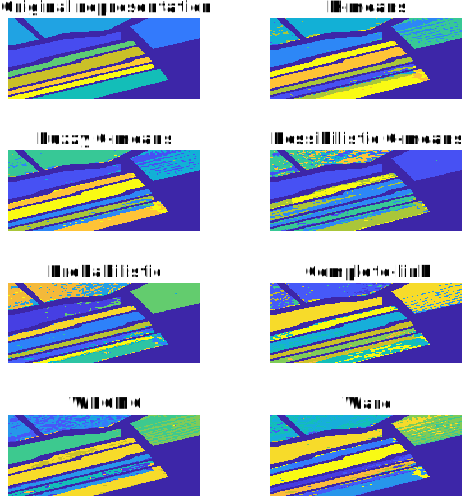

# Hyperspectral Image Processing for Salinas Valley

## Overview

This project deals with the processing of Hyperspectral Images (HSI), particularly focusing on the “Salinas” HSI. This HSI captures the Salinas valley located in California, USA. The captured HSI has a spatial resolution of 150x150 and includes 204 spectral bands, ranging from 0.2µm – 2.4µm. The spatial resolution stands at 3.7m, categorising the HSI as a 150x150x204 cube. 

This dataset is composed of 22,500 sample pixels derived from eight ground-truth classes. These classes include “Corn,” two variants of “Broccoli,” “Grapes,” and four distinct types of “Lettuce.” Each class is represented by different colors in the accompanied figure. It's worth noting that there's no ground truth information for the pixels colored in dark blue.

**Objective:** The core aim is to identify homogeneous regions within the Salinas HSI. Only pixels with a nonzero class label are utilised in this endeavour. The data used can be located in the [Salinas_Data.mat](dataset/Salinas_Data.mat) file which houses:
- A 150x150x204 three-dimensional matrix titled “Salinas_Image” (the Salinas hypercube).
- A 150x150 two-dimensional image titled “Salinas_Labels” (providing the class label for each pixel).

## Dependencies

- **Matlab 2020a**: Principal software employed for data processing and clustering.
- **Plot2LaTeX**: [Script](https://www.mathworks.com/matlabcentral/fileexchange/52700-plot2latex) that aids in creating figures and visual displays. Note: This script mandates [Inkscape](https://inkscape.org/download/) for execution.
- **Clustering Algorithms**: Algorithms are procured from the textbook [Introduction to Pattern Recognition](https://github.com/pikrakis/Introduction-to-Pattern-Recognition-a-Matlab-Approach).
- **Quantitative indices**: Scripts specifically designed to run [Adjusted Rand Index (ARI)](https://www.mathworks.com/matlabcentral/fileexchange/49908-adjusted-rand-index) and [Normalised Mutual Information (NMI)](https://www.mathworks.com/matlabcentral/fileexchange/29047-normalized-mutual-information).

## Methodology

The research focuses on juxtaposing the efficiency of:

- Cost function optimization clustering algorithms such as k-means, fuzzy c-means, possibilistic c-means, and the probabilistic clustering algorithm (with each cluster modeled by a normal distribution).
- Hierarchical algorithms like Complete-link, WPGMC, and Ward algorithms.

The methodology can be summarised as follows:

1. **Principal Component Analysis (PCA)**: Initially, a PCA was executed on the hyperspectral image to reduce dimensionality and capture the most significant features; the explainable variance threshold was set to 95%.
  
2. **Clustering**: The objective is to discern homogeneous regions in the Salinas HSI by concentrating solely on pixels that have accessible class label data. The approach involves:
   - Executing the aforementioned algorithms under different parameters to identify the homogeneous regions, and highlighting any complications discovered.
   - Qualitatively authenticating the results derived from each algorithm, based on the pixel label information and any insights gained from the image (including insights from the PCA).
  
3. **Optimal Number of Clusters**:
   - The Calinski-Harabasz criterion was employed to determine the ideal number of clusters.
   - The 'elbow' method was also utilised as a supplementary approach to verify the optimal cluster count.
  
4. **Validation**: Quantitatively corroborating the results using the labeling data.

## Key Results

- **K-means & Fuzzy C-means**: Both algorithms highlighted a resemblance in their ability to discern the underlying structure of datasets. However, the fuzzy c-means' feature allowing for overlapping clusters wasn't advantageous for this dataset.
  
- **Possibilistic C-means**: An extension of the k-means, it showcased the most inferior clustering outcomes among cost function optimization algorithms. This was majorly due to improper parameterisation and the noise's impact.

- **Probabilistic C-means**: Built on the premise that data aligns with a Gaussian mixture model, this algorithm exhibited the best results when assuming a diagonal covariance matrix for the clusters. Yet, the best result, which correlated with 11 clusters, was externally validated as incorrect.

- **Complete-link method**: Though revealing certain clusters, they lacked homogeneity due to the method’s inherent nature.

- **WPGMC Algorithm**: Showed inefficacy in identifying compact clusters, mainly due to its tendency to produce clusters of similar sizes and shapes.

- **Ward's Method**: Its efficiency closely parallels that of k-means clustering. Even though k-means is a better minimizer when provided with suitable initial centroids, Ward's method proved more accurate in discerning clusters of varied sizes or those irregularly spaced.

Further insights can be found in the [report](report/main.pdf). 

## Sample Output

Qualitative algorithms' assessment:
<p align="center">
  
</p>

Quantitative algorithms' assessment:
```bash
         Clustering_Method         Adjusted Rand Index    Normalised Mutual Information
    ___________________________    ___________________    _____________________________
    {'K-means'                }          0.68357                     0.7721           
    {'Fuzzy C-means'          }          0.69157                     0.77522           
    {'Possibilistic C-means'  }          0.3924                      0.57           
    {'Probabilistic'          }          0.78124                     0.83518           
    {'Hierarchical (complete)'}          0.5891                      0.71878           
    {'Hierarchical (WPGMC)'   }          0.43998                     0.65373           
    {'Hierarchical (ward)'    }          0.65453                     0.76373  
```
